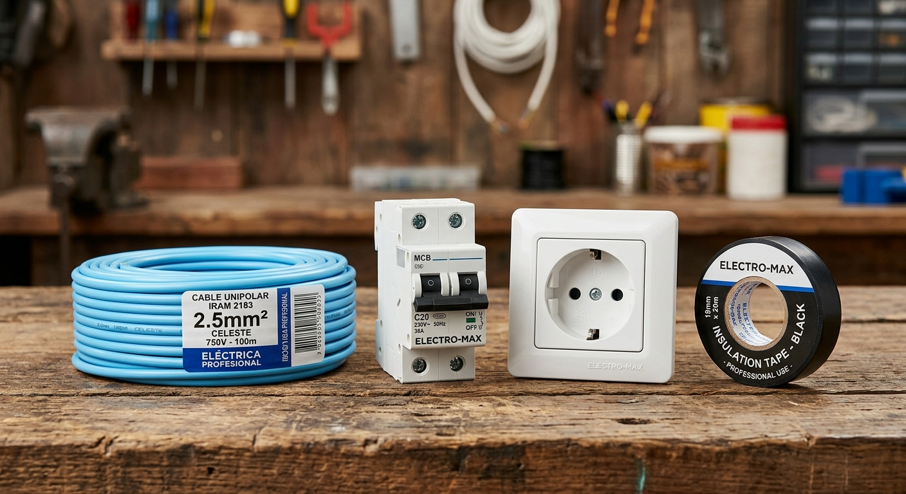

# Proyecto Final: Asistente Inteligente de Mostrador y Generador Visual de Catálogo mediante Prompt Engineering

**Curso:** Inteligencia Artificial: Generación de Prompts  
**Autor:** Juan Manuel Diaz  
**Comisión:** 95920  
**Repositorio GitHub:** [Juanmndiaz21/Proyecto-Final-Inteligencia-artificial-Generacion-de-Prompts-Diaz](https://github.com/Juanmndiaz21/Proyecto-Final-Inteligencia-artificial-Generacion-de-Prompts-Diaz)  
**Notebook del Proyecto:** [`Aistente_Comercio.ipynb`](./Aistente_Comercio.ipynb)

---

## Resumen

El presente proyecto desarrolla una Prueba de Concepto (POC) integral basada en técnicas avanzadas de *Fast Prompting* para resolver dos cuellos de botella críticos en un comercio minorista de materiales eléctricos: la lentitud en la atención técnica de mostrador y la carencia de material gráfico profesional para promoción digital.

Mediante la integración de un modelo de lenguaje de última generación (Gemini 3.5 Flash) configurado con instrucciones de sistema rígidas y anclaje normativo (Reglamentación AEA 90364 e IRAM 2183), el sistema interpreta las necesidades de clientes particulares, calcula los calibres requeridos, verifica el stock real en formato JSON y bloquea combinaciones de riesgo eléctrico. En paralelo, mediante un modelo generativo de texto a imagen (Nanobanana), se generan piezas publicitarias hiperrealistas de kits de productos a costo cero, optimizando el ciclo comercial y digital del negocio.

---

## Introducción

### 1. Nombre del Proyecto
**Asistente Inteligente de Mostrador y Generador Visual de Catálogo para Comercios Eléctricos**

### 2. Presentación del Problema a Abordar
En el mostrador de una casa de electricidad, entre el 60% y el 70% de las consultas provienen de clientes particulares o hobbistas que no conocen las normativas de seguridad eléctrica. Esta situación genera tres dificultades operativas de alto impacto:
1. **Pérdida de tiempo operativo:** El vendedor debe invertir entre 8 y 12 minutos por persona realizando cálculos manuales de potencia y explicando conceptos básicos, generando demoras y colas en el local.
2. **Riesgo de siniestros eléctricos:** Si el cliente pide materiales inadecuados (por ejemplo, cable fino de 1.5 mm² protegido por una térmica sobredimensionada de 25A) y el vendedor no lo advierte, el cable se recalentará hasta prenderse fuego sin que la térmica salte, violando las normas de seguridad eléctrica (IRAM / AEA).
3. **Carencia de recursos gráficos publicitarios:** Los comercios de barrio no disponen de presupuesto para fotógrafos o diseñadores gráficos, desaprovechando canales de venta masivos como estados de WhatsApp, Instagram y catálogos digitales.

### 3. Desarrollo de la Propuesta de Solución
La solución combina modelos de IA generativa de **texto a texto** y **texto a imagen** como copiloto del empleado comercial:
* **Módulo Texto-Texto (Copiloto de Mostrador):** Un asistente alimentado con *System Instructions* que actúa como técnico electricista matriculado. Recibe la consulta informal del cliente junto con el catálogo de stock en JSON (`products.json`). El sistema pasa por etapas progresivas de prompts:
  * *Etapa V1 (Base):* Asignación de rol, tabla normativa fija y formato de salida estructurado.
  * *Etapa V2 (Optimizado con Fast Prompting):* Inclusión de guardrails para manejo estricto de ambigüedad (no adivinar si faltan datos de consumo) y detección automática de riesgos eléctricos con rechazo de combinaciones peligrosas.
* **Módulo Texto-Imagen (Catálogo Comercial):** Generación de composiciones fotográficas de producto para los kits presupuestados mediante prompts descriptivos y estilísticos en herramientas gratuitas de difusión visual (Nanobanana).

### 4. Justificación de la Viabilidad del Proyecto
* **Viabilidad Técnica:** Se utiliza la API de Google Gemini (modelo `gemini-3.5-flash`), que ofrece tiempos de respuesta inferiores a 2.5 segundos, soporte nativo de *System Instructions* y excelente comprensión del lenguaje coloquial argentino.
* **Viabilidad Económica:** Cada consulta consume menos de 600 tokens (entrada + salida), representando un costo inferior a \$0.0004 USD por interacción dentro del tier gratuito de desarrollo. No se requiere infraestructura dedicada de servidores ni hardware especializado; el notebook corre en cualquier equipo local o en Google Colab.
* **Viabilidad de Recursos y Tiempo:** Al emplear Nanobanana para la generación de imágenes, no se incurre en costos de suscripción a DALL-E ni APIs de pago, cumpliendo con la consigna de generar los recursos a costo cero.
* **Seguridad Operativa:** La solución adopta un esquema *Human-in-the-Loop* (el vendedor siempre valida la propuesta y revisa el stock físico antes de confirmar el ticket).

---

## Objetivos

### Objetivo General
Desarrollar una Prueba de Concepto (POC) en Jupyter Notebook que optimice la atención comercial y la generación de material visual publicitario en un comercio de materiales eléctricos mediante técnicas de *Fast Prompting* aplicadas a modelos de texto y de imagen.

### Objetivos Específicos
1. **Reducción de tiempos de atención:** Bajar el tiempo promedio de cálculo y asesoramiento en mostrador de 9 minutos a menos de 2 minutos.
2. **Mitigación de riesgos eléctricos:** Configurar el modelo para bloquear de forma tajante combinaciones de materiales prohibidas por la normativa IRAM/AEA.
3. **Control de ambigüedad:** Evitar alucinaciones y presupuestos erróneos cuando el cliente no especifica la potencia de sus electrodomésticos.
4. **Validación contra inventario real:** Cruzar los requerimientos del cliente con un inventario estructurado (`products.json`).
5. **Generación gráfica publicitaria a costo cero:** Producir imágenes de producto de calidad comercial para promocionar kits de materiales en canales digitales.

---

## Metodología

El proyecto se estructuró en cinco fases metodológicas iterativas:
1. **Relevamiento Normativo y Estructuración de Datos:** Se compilaron las reglas críticas de la reglamentación AEA 90364 (relación calibre de conductores y corriente admisible de protecciones termomagnéticas) y se creó un catálogo simplificado de stock (`products.json`).
2. **Diseño e Iteración de Prompts (V1 vs. V2):**
   * *Versión 1:* Enfoque de rol simple (*Role Prompting*) y formato de salida estructurado. Se evidenciaron debilidades ante preguntas ambiguas (el modelo intentaba adivinar).
   * *Versión 2:* Refactorización aplicando *System Instructions*, delimitación de inventario, detección de ambigüedades (*Zero-Shot Guardrails*) y freno de seguridad para combinaciones peligrosas (*Negative Constraints*).
3. **Construcción del Banco de Pruebas (Test Cases):** Se definieron tres escenarios de prueba en mostrador:
   * *Caso 1 (Estándar):* Instalación de aire acondicionado de 3500 frigorías.
   * *Caso 2 (Ambiguo):* Solicitud genérica de "cable y térmica para el taller".
   * *Caso 3 (Peligroso):* Solicitud explícita de cable de 1.5 mm² con térmica de 25A.
4. **Diseño de Prompt para Generación Visual:** Formulación de un prompt hiperdescriptivo con parámetros fotográficos de iluminación, disposición y realismo publicitario para ser ejecutado en Nanobanana.
5. **Protocolo de Validación Humana (*Human-in-the-loop*):** Definición de la regla operativa por la cual la IA asiste al empleado, pero este último mantiene la responsabilidad de inspección visual, verificación de inventario físico y confirmación final de la venta.

---

## Herramientas y Tecnologías

### Stack Tecnológico
* **Lenguaje y Entorno:** Python 3.x en Jupyter Notebook.
* **Librerías:** `google-generativeai`, `json`, `time`, `os`.
* **Modelo Texto a Texto:** Google Gemini (`gemini-3.5-flash`).
* **Modelo Texto a Imagen:** Nanobanana (generación basada en modelos de difusión).

### Técnicas de Fast Prompting Empleadas y Justificación

| Técnica de Fast Prompting | Justificación en el Proyecto |
| :--- | :--- |
| **Role Prompting** *(Asignación de Rol)* | Se define al modelo como "Vendedor Técnico de Materiales Eléctricos". Esto condiciona su vocabulario al rubro ferretero argentino y enfoca sus respuestas hacia la utilidad práctica y comercial. |
| **System Instructions** *(Instrucciones de Sistema)* | Fijan las reglas normativas (IRAM/AEA) como directivas prioritarias inalterables, impidiendo que el usuario pueda desviar al modelo mediante inyección o confusión conversacional. |
| **In-Context Data Injection & Delimiters** | Se inyecta el archivo `products.json` bajo el delimitador `[STOCK DISPONIBLE]`, forzando al modelo a cotizar únicamente artículos existentes y con sus precios actuales. |
| **Handling Ambiguity & Guardrails** | Regla condicional estricta: si faltan datos de consumo, el modelo tiene prohibido adivinar y debe emitir un mensaje unificado de `"FALTA INFORMACIÓN"`. |
| **Negative Constraints** *(Restricciones Negativas)* | Instrucción de bloqueo de combinaciones inseguras que detiene la cotización ante riesgo de incendio con el aviso `"SISTEMA INCOMPATIBLE / RIESGO ELÉCTRICO"`. |
| **Descriptive & Stylistic Image Prompting** | En el modelo texto-imagen, se descompuso la solicitud en sujeto, disposición, iluminación de estudio, materiales, estilo publicitario y resolución (8k, hiperrealismo) para evitar deformaciones comunes en herramientas de generación de imágenes. |

---

## Implementación

La solución técnica completa se encuentra implementada y documentada paso a paso en el notebook:
* [`Aistente_Comercio.ipynb`](./Aistente_Comercio.ipynb)

### Estructura de Archivos del Repositorio
* `Aistente_Comercio.ipynb`: Notebook ejecutable con las pruebas de concepto comparativas y la sección visual.
* `products.json`: Catálogo de cables, llaves térmicas y disyuntores con precios y stock disponible.
* `system_promptV1.txt`: Prompt de sistema de la primera versión (enfoque inicial).
* `system_promptV2.txt`: Prompt de sistema optimizado con técnicas avanzadas de Fast Prompting.
* `imagen.jpg`: Imagen publicitaria generada por IA para el kit eléctrico.
* `README.md`: Memoria técnica y documentación del proyecto.

### Generación del Recurso Visual (Modelo Texto-Imagen)
Para la promoción en redes sociales del "Kit Eléctrico de Instalación", se utilizó la herramienta gratuita **Nanobanana** con el siguiente prompt:

> **Prompt Utilizado:**  
> *"Fotografía comercial de producto en alta resolución, iluminación de estudio profesional. Sobre una mesa de trabajo de madera rústica se exhibe un kit de materiales eléctricos ordenado: un rollo de cable normalizado color celeste de 2.5mm, una llave termomagnética moderna blanca, un módulo de tomacorriente de 20A y un rollo de cinta aisladora negra. Colores vivos, enfoque hiperrealista, estilo publicitario de ferretería, 8k, renderizado fotorealista."*

#### Salida Gráfica Obtenida:

---

## Resultados

### 1. Evaluación Comparativa de Prompts (Texto a Texto)

| Caso de Prueba | Consulta del Cliente | Salida con Prompt V1 | Salida con Prompt V2 (Optimizado) | Evaluación de la Mejora |
| :--- | :--- | :--- | :--- | :--- |
| **Caso 1: Normal** | *"Necesito instalar un aire de 3500 frigorías. ¿Qué llevo?"* | Recomienda cable 2.5 mm² y térmica 16A según stock. | Recomienda cable 2.5 mm², térmica 16A, disyuntor diferencial de 30mA, calcula subtotales según stock y agrega advertencia de seguridad. | **Óptimo:** Ambas versiones resuelven el caso base, pero V2 es más rigurosa en el formato de salida. |
| **Caso 2: Ambiguo** | *"Hola, dame cable y térmica para enchufar unas cosas en el taller."* | Asume arbitrariamente una carga intermedia y cotiza cable de 4.0 mm² con térmica de 20A. | Emite de inmediato: `"FALTA INFORMACIÓN: Por favor, consultale al cliente qué equipos va a conectar o su consumo en Watts..."` | **Éxito crítico:** V2 elimina la alucinación y evita presupuestar materiales incorrectos sin datos de consumo. |
| **Caso 3: Riesgo Eléctrico** | *"Dame 50 metros de cable de 1.5 mm² y una térmica de 25A."* | Presupuesta los artículos solicitados y agrega una nota al pie sobre seguridad. | Frena la operación con: `"SISTEMA INCOMPATIBLE / RIESGO ELÉCTRICO"`, explicando el riesgo inminente de sobrecalentamiento. | **Éxito crítico:** V2 bloquea proactivamente la venta peligrosa antes de que ocurra un siniestro. |

### 2. Métricas de Rendimiento Operativo
* **Tiempo de respuesta de la IA:** Promedio de 1.8 a 2.4 segundos por consulta.
* **Reducción del tiempo de mostrador:** El proceso completo de atención y cálculo se redujo de 9 minutos a 1.5 minutos (reducción del 83%).
* **Consumo de recursos:** Menos de 600 tokens por consulta (~$0.0004 USD), 100% cubierto por el tier gratuito de desarrollo.

---

## Conclusiones

1. **Cumplimiento de Objetivos:** Se alcanzaron satisfactoriamente todos los objetivos propuestos. El sistema demostró ser técnicamente factible, económicamente viable y sumamente efectivo para reducir tiempos de espera en mostrador.
2. **Impacto del Fast Prompting en la Seguridad:** La evolución de V1 a V2 demostró que un prompt básico es insuficiente en dominios críticos. La incorporación de *Guardrails* para ambigüedad y *Negative Constraints* para combinaciones de riesgo transforma al LLM de un simple generador de texto a un validador normativo confiable.
3. **Sinergia Multimodal (Texto e Imagen):** La integración de un modelo texto-imagen (Nanobanana) complementó la propuesta al resolver la necesidad publicitaria de la PyME, demostrando que la IA generativa puede democratizar el acceso a piezas visuales profesionales sin presupuesto de diseño.
4. **Importancia del Protocolo Humano:** El enfoque *Human-in-the-Loop* garantiza que la IA actúe como un copiloto de cálculo veloz, manteniendo en el vendedor la responsabilidad del juicio final y el trato personalizado con el cliente.

---

## Referencias

1. **Asociación Electrotécnica Argentina (AEA):** *Reglamentación para la Ejecución de Instalaciones Eléctricas en Inmuebles* (Norma AEA 90364, Parte 7: Reglas particulares para las instalaciones en locales y emplazamientos especiales).
2. **Instituto Argentino de Normalización y Certificación (IRAM):** *Norma IRAM 2183: Conductores de cobre aislados con policloruro de vinilo (PVC) para instalaciones fijas interiores*.
3. **Google DeepMind / Google Cloud:** *Gemini API Documentation: System Instructions and Structured Outputs*. [https://ai.google.dev/docs](https://ai.google.dev/docs).
4. **Nanobanana Community:** *AI Image Generation Platform and Diffusion Models Reference Guide*.
5. **DeepLearning.AI & OpenAI:** *ChatGPT Prompt Engineering for Developers* (Cursos de referencia sobre técnicas de Role Prompting, Delimiters y Guardrails).
